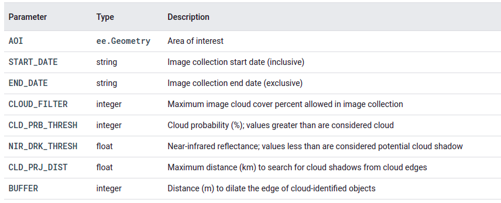
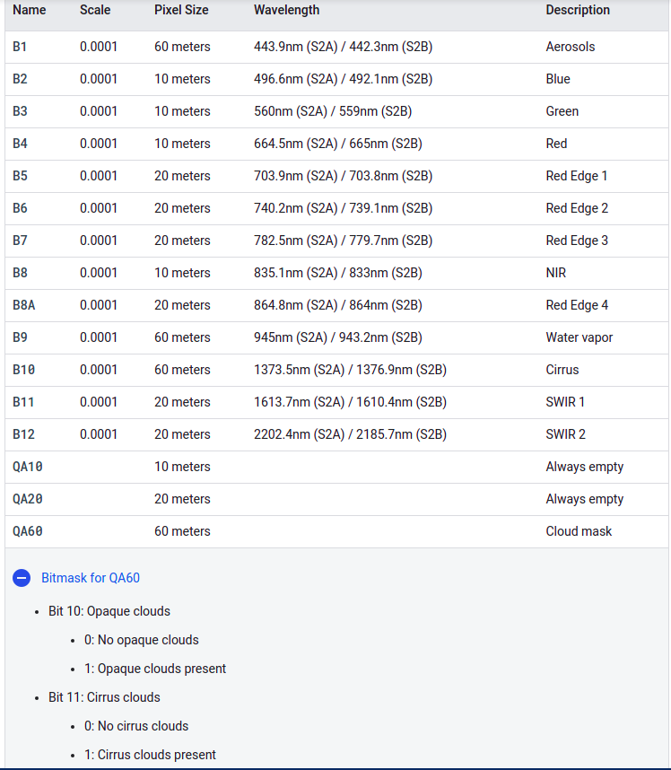

# Data Processing and Cleaning

In the Earth Engine Data Catalog, datasets can be of different types:

Features which are geometric objects with a list of properties. For example, a watershed with some properties such as name and area, is an ee.Feature. Images which are like features, but may include several bands. For example, the ground elevation given by the USGS here is an ee.Image. Collections which are groups of features or images. For example, the Global Administrative Unit Layers giving administrative boundaries is a ee.FeatureCollection and the MODIS Land Surface Temperature dataset is an ee.ImageCollection.

# Cloud cleaning
The technology of Earth observation has evolved considerably, and remote sensing (RS) imagery is the main method of technical analysis. RS is highly applicable to a wide variety of fields such as agricultural production, ecological construction, military reconnaissance and geological studies. However the reflected light from ground objects captured by optical sensors inevitably undergoes absorption and scattering from the atmosphere. Data detected by RS can be partially or even completely obscured by clouds, which hinders the implementation of global surveying and mapping missions, thus weakening the potential of RS for Earth exploration.

Using google earth engine data involves to know what parametters to tune for better cleaning result. GEE helps masking clouds and cloud shadows in Sentinel-2 (S2) surface reflectance (SR)

Clouds are identified from the S2 cloud probability dataset (s2cloudless) and shadows are defined by cloud projection intersection with low-reflectance near-infrared (NIR) pixels

list of parameters that are used to filter the S2 image collection and determine cloud and cloud shadow identification.

For `ee.ImageCollection("COPERNICUS/S2") ` Filtercloud mean exploiting QA60 band

# Display the cloud-free composite
Understanding how Earth Engine handles scale is crucial to interpreting scientific results obtained from Earth Engine. Here, scale means pixel resolution. Unlike other GIS and image processing platforms, the scale of analysis is determined from the output, rather than the input. Specifically, when you make a request for results, an image to display or a statistic, for example, you specify the scale at which data is input to the analysis.

